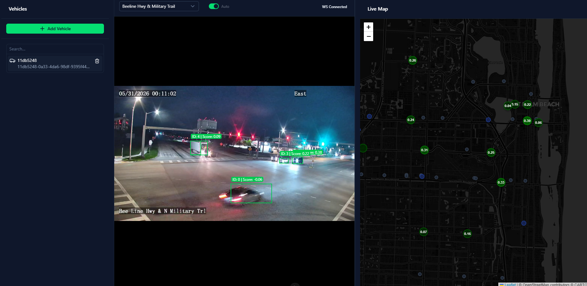

# Car Tracker

This project is a [Flock](https://www.flocksafety.com/)-style car tracking program that runs in real time.

I implemented [this paper](https://arxiv.org/pdf/2110.07933v2) using PyTorch and trained the model on the [Veri-776 dataset](https://www.kaggle.com/datasets/abhyudaya12/veri-vehicle-re-identification-dataset?resource=download). You can see my training code in [train](train/). Then, I made a simple [web server](server/) to serve the data over a websocket through an SSH tunnel from the supercomputer to my local device. The system takes advantage of multiple GPUs using the multiprocessing library and shared memory.

I also made a [dashboard](client/) to visualize it all using the Nuxt.js framework.

implemented model performance:

Rank-1|Rank-5
-|-
81.2%|92.0%

---

bugs to fix:

- some streams only load when you refresh the page
- selecting a vehicle in the dashboard turns the simmilarity score on the map on instead of off
